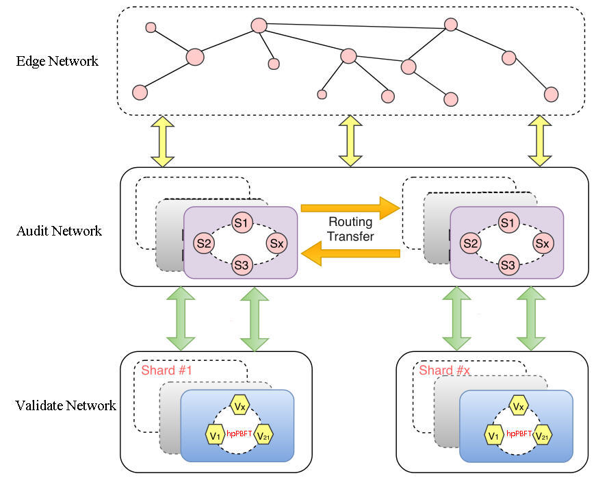
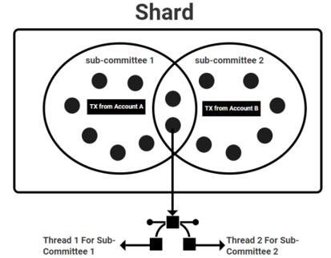

# Consensus Protocol

## Overview

It is difficult to achieve data consistency in a distributed network of nodes.

A node must be selected through a certain mechanism, and this node decides which transaction needs to be processed at this time. It broadcasts the execution result of this transaction to other nodes for verification or storage. Therefore, the consistency of node data in the entire network can be achieved . We call this node "leader", and the mechanism for selecting the leader and reaching data agreement is called "consensus mechanism".

The leader is elected through the VRF-FTS. The chance of being selected as a hpPBFT leader according to the comprehensive stake of the node, more about comprehensive, please refer to [Node Elections](docs-en/Node/NodeElection.md).

## Three Layer Consensus Network

The TOP Network consensus network is divided into three layers:
The Edge Network: All transactions will be sent to edge network before reaching the audit network.

The Audit Network: Consists of audit nodes randomly partitioned into clusters, and handles most of the bandwidth heavy operations such as cross-shard communication, and participate in transaction validation.

The Validate Network: Consists of shard made up of validator nodes. This is where the transactions validation takes place. Within each shard, validator nodes validate and confirm transactions using a parallel hpPBFT algorithm.

A tiered network is used for multiple reasons. First, splitting duties among multiple types of nodes helps keep node requirements low. The Audit Network handles most of the bandwidth heavy operations such as cross-shard communication, which allows validator nodes to have relatively low requirements. In addition, the Edge Network helps protect the Audit and Validate Network from spam attacks, as clients can only send transactions directly to edge Nodes.

## Consensus Algorithm

### Highly-Parallel pBFT

TOP Network’s pBFT inspired algorithm, dubbed hpPBFT, adopts a three-phase commit stratagem which permits O(n) communication complexity with O(n) view-change complexity. The algorithm uses VRF time-based view changes, but adds additional security through a secondary audit network, and increased scalability through parallelization.

### Secondary Audit

TOP Network’s hpPBFT avoids this issue by making a change to the protocol which lowers the view-change complexity to O(n), while increasing security. The view-change process is simplified by using a 3-phase commit paradigm instead of the usual 2-phase commit. While inserting an extra phase adds a small amount of latency, it is well worth it to achieve linear leader replacement complexity. 

Security of the protocol is increased by introducing an audit committee and leader from the audit network. During each view, the audit committee performs their owns checks along with the original pBFT group. As a result, consensus does not rely too heavily on the original pBFT leader. Even if a shard is compromised or the leader is malicious, the audit network will prevent any invalid state transitions.

### Completely Parallel Consensus

TOP applies several techniques to produce a high degree of parallelization. Besides the obvious parallel nature of sharding in general, TOP implements several other forms of parallelization.

#### Node Virtualization Over Multiple CPU Cores

In our design, each node can take on multiple roles simultaneously. For instance, an Advance node can perform the duties of a Validator node concurrently. The necessary code for each type of node is assigned to run on separate CPU cores. This expands the total useful work a node can do, and essentially increases node count, thus increases overall scalability. It also helps to make shards more secure, as Advance nodes which have higher staking requirements can act as Validators, making it harder for attackers to gain the majority of stake within a shard. To be eligible for this functionality, a node needs to meet the minimum deposit and voting requirements set for Advance nodes.

#### Parallel Subset Committee Consensus

As with all sharding designs, each shard can perform transaction validation in parallel with other shards. However, TOP goes one step further and allows for further parallelization within a shard. For each transaction sent from each account, a subset of nodes within the destination shard is randomly selected via VRF-FTS algorithm to form a consensus committee. If multiple transactions from accounts within the same account subspace are sent at the same time, multiple sub-committees within the associated shard will be selected simultaneously. In some cases, the same Validator node will be selected to participate in multiple sub-committees at the same time. This is accomplished through multi-threading techniques.
Each node can use multiple threads to execute the consensus algorithm in multiple sub-groups at the same time (fig 6). This extra level of parallelization is made possible due to the account chain model discussed in chapter [Chain Data Structure](docs-en/AboutTOPNetwork/TOPChainInfrastructure/DataStructure.md).

### PoS*

pBFT algorithms on their own are not secure in a permissionless setting. Instead, these algorithms need to be paired with some form of Sybil resistance. For blockchains like Bitcoin and Ethereum, PoW is used as the Sybil resistance mechanism. However, PoW is very energy inefficient, and requires nodes to use expensive mining equipment. TOP Network Chain instead uses Proof-of-Stake (PoS) to prevent Sybil attacks.
PoS dictates that nodes must deposit stake in the form of the native blockchain token in order to join the network. This makes it expensive for malicious entities to gain control of enough nodes to launch attacks.

In most forms of PoS, the only factor determining a node’s eligibility to join the network is a minimum deposit of the blockchain’s native token. TOP expands this concept into what we call Comprehensive Stake—which is represented by the the * in hpPBFT-PoS*. Comprehensive stake takes into account multiple factors to determine how likely a node is to participate in consensus. These are:

**Deposit**: The main component of the Comprehensive Stake is the number of TOP tokens deposited. Each types of node on TOP has differing requirements in terms of the minimum deposit to be eligible.
**Credit**: A node’s contribution history is used as a form of credit or reputation. The more jobs successfully completed by a node, the higher its credit, and thus Comprehensive Stake. If a node’s bandwidth or compute power is too low compared to the rest of the nodes, its reputation score will drop.

**Voting**: Any token holder can use their tokens to vote for a particular node. The more votes a node receives, the higher its chances of election. TOP allows for proxy voting via smart-contract. Token holders can pledge their tokens to another individual or organization to vote on their behalf.

## Transaction Consensus Process

Single account transactions only need a round of consensus, the transaction sending account and receiving account are the same, the account operation its own properties.

Cross-account transactions need three rounds of consensus:

Taking account A to account B transfer 200 TOP token as an example, the cross-account transaction consensus process is shown in the figure below.

1.The transaction is routed to Network 1 where account A is located.

2.The sender transaction consensus was successful, and the balance of account A decreased by 200 TOP.

Sender transaction process:

The hpPBFT leader verifies the transaction at first. After the verification, the verification results will be broadcast to other nodes in Network 1, and the other nodes will verify the results. When the leader receives the signature or votes from 2/3 nodes in Network 1, the consensus will be successful, and the block will be stored in the database. Meanwhile, the balance of account A is reduced by 200 TOP.

3.Post the transaction and transaction sending receipt to Network 1 where the account A is located.

The transaction receipt consists of the transaction multiple signatures and the Merkle tree path. The function of the transaction receipt is to prove that the transaction consensus is  successful, including sending transaction receipt and receiving transaction receipt.

4.The receiver transaction consensus was successful, and the balance of account B increased by 200 TOP.

Refer to the process of sending transaction consensus to gain a better understanding of how this works.

5.Post the receiving transaction receipt to Network 1 where the account A is located.

6.Each node in Network 1 confirms that the transaction receipt. If the transaction is timed out and has not been received, the transaction sending receipt will be reposted.

## Table Block Status

The transaction will go through three rounds of consensus before it is finally confirmed, and each consensus block will go through the following three states.

After the first consensus, the state of the block will be "HighQC"; after the second consensus, the state of the block will change to the "Lock" state; after the third consensus, the state of the block will change to the final confirmation state "Commit".

The consensus leader will be updated in each round of consensus and when the new leader finds that there are no transactions in the transaction pool, an empty block is created to help the last block to reach the "Commit" status.

